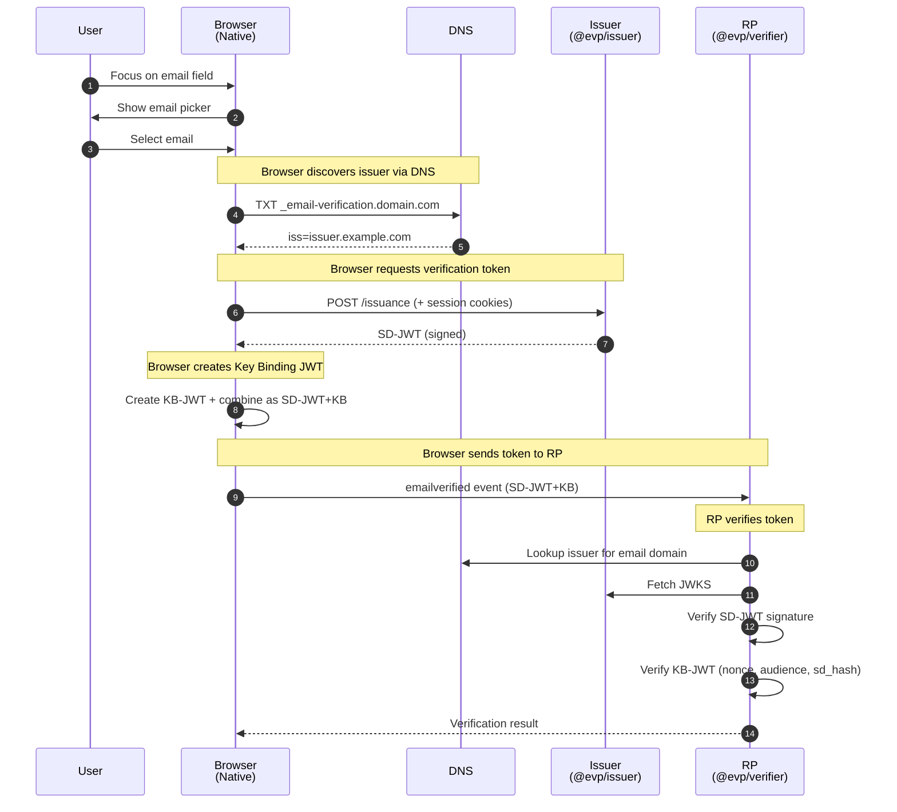

# EVP - Email Verification Protocol Libraries

> ⚠️ **Early Stage Project**: This is an implementation of the [WICG Email Verification Protocol](https://github.com/WICG/email-verification-protocol), which is currently in incubation. The protocol specification may change, and browser support is not yet available. This library is intended for experimentation, testing, and to contribute to the ecosystem development.

## What is EVP?

The Email Verification Protocol enables web applications to obtain cryptographically verified email addresses without sending verification emails. Instead of the traditional "click the link in your email" flow, EVP allows instant verification when the user is already logged into their email provider.

```
Traditional Flow:
User → Enter email → Wait for email → Click link → Verified ❌ (slow, prone to drop-off)

EVP Flow:
User → Select email → Instant verification ✅ (seamless, no context switch)
```

## Current Status

| Component | Status |
|-----------|--------|
| WICG Specification | 📝 Draft (actively developed) |
| Chrome Implementation | 🧪 Intent to Prototype (Sep 2025) |
| Firefox Implementation | ❓ No signal |
| Safari Implementation | ❓ No signal |
| Reference Issuer | ❌ None public |
| Reference Verifier | ❌ None public |

**This library aims to provide the missing reference implementations.**

## Realistic Expectations

### What This Library CAN Do

- ✅ Implement a spec-compliant EVP issuer for email providers
- ✅ Implement a spec-compliant EVP verifier for web applications (RPs)
- ✅ Enable testing and experimentation with the protocol
- ✅ Serve as reference implementation for the community
- ✅ Help identify issues and improvements for the spec

### What This Library CANNOT Do

- ❌ Make EVP work in browsers (requires native browser support)
- ❌ Replace traditional email verification today
- ❌ Work without email provider adoption
- ❌ Guarantee the spec won't change

### When Should You Use This?

| Use Case | Recommendation |
|----------|----------------|
| Production email verification today | ❌ Use traditional methods |
| Experimenting with EVP | ✅ Yes |
| Building an email provider that wants to support EVP early | ✅ Yes |
| Preparing your web app for future EVP support | ✅ Yes |
| Contributing to the EVP ecosystem | ✅ Yes |

## Packages

This monorepo contains three packages:

| Package | Description | Status |
|---------|-------------|--------|
| [`@evp/core`](./docs/core.md) | Shared types, constants, and utilities | ✅ Implemented |
| [`@evp/issuer`](./docs/issuer.md) | EVP issuer implementation for email providers | ✅ Implemented |
| [`@evp/verifier`](./docs/verifier.md) | EVP verifier implementation for web apps (RPs) | ✅ Implemented |

## Architecture Overview



> **Note:** Steps 1-3 and the `emailverified` event require **native browser support** (not yet available).
> This library implements the **server-side components**: `@evp/issuer` (steps 4-5) and `@evp/verifier` (verification).

## Installation

```bash
# Using npm
npm install @evp/core @evp/issuer @evp/verifier

# Using pnpm
pnpm add @evp/core @evp/issuer @evp/verifier

# Using yarn
yarn add @evp/core @evp/issuer @evp/verifier
```

## Quick Start

### For Email Providers (Issuer)

```typescript
import { EmailVerificationIssuer } from '@evp/issuer';

// Initialize with your signing key
const issuer = new EmailVerificationIssuer({
  issuer: 'mail.example.com',
  privateKey: yourPrivateKeyJWK,
  kid: '2024-01-key',
  algorithm: 'EdDSA'
});

// Serve /.well-known/email-verification
app.get('/.well-known/email-verification', (req, res) => {
  res.json(issuer.getMetadata('https://mail.example.com'));
});

// Serve JWKS
app.get('/email-verification/jwks', async (req, res) => {
  res.json(await issuer.getJWKS());
});

// Handle issuance requests
app.post('/email-verification/issuance', async (req, res) => {
  // ... see full example in docs/issuer.md
});
```

### For Web Applications (Verifier/RP)

```typescript
import { EmailVerificationVerifier } from '@evp/verifier';

const verifier = new EmailVerificationVerifier({
  rpOrigin: 'https://myapp.example.com'
});

// When you receive an SD-JWT+KB from the browser
async function handleEmailVerification(sdJwtKb: string, sessionNonce: string) {
  try {
    const result = await verifier.verify(sdJwtKb, sessionNonce);
    
    console.log('Verified email:', result.email);
    console.log('Issuer:', result.issuer);
    console.log('Issued at:', result.issuedAt);
    
    // Proceed with user registration/login
  } catch (error) {
    // Handle verification failure
  }
}
```

## Testing Without Browser Support

Since browsers don't yet support EVP, you can test the protocol using our test utilities:

```typescript
import { createTestFlow } from '@evp/core/testing';
import { EmailVerificationVerifier } from '@evp/verifier';

// Create test fixtures with mock DNS and JWKS
const testFlow = await createTestFlow({
  issuer: 'issuer.example.com',
  rpOrigin: 'https://myapp.example.com',
});

// Create verifier with test mocks
const verifier = new EmailVerificationVerifier({
  rpOrigin: 'https://myapp.example.com',
  dnsResolver: testFlow.dnsResolver,
  fetch: testFlow.fetch,
});

// Create a token (simulates browser + issuer interaction)
const token = await testFlow.createToken('user@example.com', 'session-nonce');

// Verify as the RP would
const result = await verifier.verify(token, 'session-nonce');
console.log(result.email); // 'user@example.com'
```

## Design Decisions

### Why Not Use `@sd-jwt/*` from OpenWallet Foundation?

We evaluated the OpenWallet Foundation's SD-JWT implementation and decided to build a minimal, EVP-specific solution:

| Factor | `@sd-jwt/*` | `@evp/*` |
|--------|-------------|----------|
| Focus | Generic SD-JWT/VC | EVP-specific |
| Packages | 10+ interdependent | 3 focused |
| Dependencies | Multiple internal | 1 external (`jose`) |
| Bundle size | ~50-100KB | ~10-15KB |
| Selective Disclosure | Full implementation | Not needed for EVP |
| DNS resolution | Not included | Built-in |
| EVP error codes | Generic | Spec-compliant |

**EVP uses SD-JWT in a very limited way** - it only uses the Key Binding feature, not Selective Disclosure. Building on top of a full SD-JWT implementation would add unnecessary complexity.

### Why `jose` as the Only Dependency?

- **Zero dependencies** itself
- **Tree-shakeable** ESM exports
- **~8KB** minified + gzipped
- **Multi-runtime** support (Node, Browser, Deno, Bun, Cloudflare Workers)
- **Well-maintained** by Filip Skokan (4900+ stars)
- **Battle-tested** in production OAuth/OIDC implementations

## Security Considerations

### What This Library Handles

- ✅ Cryptographic signature verification (SD-JWT and KB-JWT)
- ✅ Timestamp validation with configurable tolerance
- ✅ Nonce verification to prevent replay attacks
- ✅ Issuer validation against DNS records
- ✅ sd_hash verification to bind KB-JWT to SD-JWT

### What You Must Handle

- ⚠️ **Session management**: Securely generate and store nonces
- ⚠️ **HTTPS**: All endpoints must use HTTPS
- ⚠️ **Key management**: Securely store and rotate signing keys
- ⚠️ **User authentication**: Verify users control emails before issuing tokens
- ⚠️ **Rate limiting**: Protect issuance endpoints from abuse

### Known Limitations

1. **DNS dependency**: If DNS is compromised, attackers could redirect verification
2. **Email provider trust**: You're trusting email providers to correctly verify ownership
3. **Cookie-based auth**: Requires users to be logged into their email provider in the browser

## Contributing

We welcome contributions! This project is specifically designed to:

1. **Test the EVP specification** - Find edge cases and issues
2. **Provide feedback to WICG** - Improve the protocol
3. **Build ecosystem tooling** - Help adoption when browsers support EVP

### Areas Where Help is Needed

- [ ] Security review and threat modeling
- [ ] Test coverage for edge cases
- [ ] Documentation and examples
- [ ] Integration examples (Express, Hono, Fastify, etc.)
- [ ] Feedback on API ergonomics

### Development

```bash
# Clone the repository
git clone https://github.com/evp-js/evp.git
cd evp

# Install dependencies
pnpm install

# Build all packages
pnpm build

# Run tests
pnpm test

# Run tests with coverage
pnpm test:coverage
```

## Roadmap

### Phase 1: Core Implementation ✅
- [x] `@evp/core` - Types, constants, utilities
- [x] `@evp/issuer` - Issuer implementation
- [x] `@evp/verifier` - Verifier implementation
- [x] Test suite (144 tests, 80%+ coverage)
- [x] Testing utilities (`createTestFlow`, `MockDnsResolver`)

### Phase 2: Testing & Validation (Current)
- [ ] End-to-end test flow simulation
- [ ] Spec compliance tests
- [ ] Security audit
- [ ] Performance benchmarks

### Phase 3: Ecosystem
- [ ] Framework integrations (Express, Hono, Fastify)
- [ ] Example implementations
- [ ] Documentation site
- [ ] Feedback to WICG

### Phase 4: Production Readiness (When Browsers Support EVP)
- [ ] Production hardening
- [ ] Monitoring and observability hooks
- [ ] Migration guides

## Related Resources

- [WICG Email Verification Protocol Spec](https://github.com/WICG/email-verification-protocol)
- [Chrome Intent to Prototype](https://groups.google.com/a/chromium.org/g/blink-dev/c/pWfWupaOtJw)
- [SD-JWT Specification (IETF RFC 9901)](https://www.rfc-editor.org/rfc/rfc9901.html)
- [jose Library](https://github.com/panva/jose)

## License

MIT License - See [LICENSE](./LICENSE) for details.

## Disclaimer

This software is provided "as is" without warranty of any kind. The EVP protocol is still in development and may change significantly. Do not use this in production for critical email verification flows until:

1. The WICG specification is stable
2. Major browsers implement the protocol
3. This library has undergone security audits

---

**Built with curiosity and contribution to the open web in mind.**
