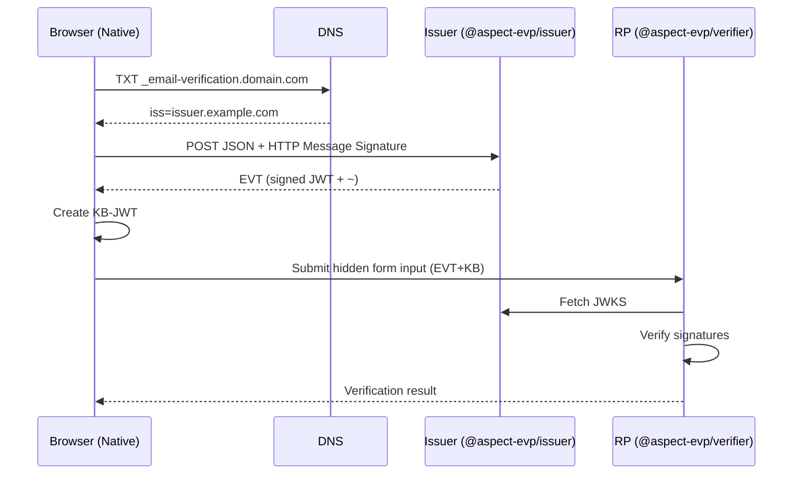

# EVP - Email Verification Protocol Libraries

[](https://www.npmjs.com/package/@aspect-evp/core)
[](https://github.com/aspect-evp/evp-js/actions/workflows/ci.yml)
[](https://opensource.org/licenses/MIT)

> ⚠️ **Experimental**: This project tracks the [WICG Email Verification API](https://github.com/WICG/email-verification) and [IETF Email Verification Protocol draft](https://datatracker.ietf.org/doc/draft-hardt-email-verification/). Both are works in progress and may change before standardization.

## What is EVP?

The Email Verification Protocol enables web applications to obtain cryptographically verified email addresses without sending verification emails. Instead of the traditional "click the link in your email" flow, EVP allows instant verification when the user is already logged into their email provider.

```
Traditional Flow:
User → Enter email → Wait for email → Click link → Verified ❌ (slow, prone to drop-off)

EVP Flow:
User → Select email → Instant verification ✅ (seamless, no context switch)
```

## Packages

| Package | Description | npm |
|---------|-------------|-----|
| [`@aspect-evp/core`](./packages/core) | Shared types, constants, and utilities | [](https://www.npmjs.com/package/@aspect-evp/core) |
| [`@aspect-evp/issuer`](./packages/issuer) | EVP issuer for email providers | [](https://www.npmjs.com/package/@aspect-evp/issuer) |
| [`@aspect-evp/verifier`](./packages/verifier) | EVP verifier for web apps (RPs) | [](https://www.npmjs.com/package/@aspect-evp/verifier) |
| [`@aspect-evp/cli`](./packages/cli) | CLI for testing and debugging | [](https://www.npmjs.com/package/@aspect-evp/cli) |

## Installation

```bash
# Core libraries
npm install @aspect-evp/core @aspect-evp/issuer @aspect-evp/verifier

# CLI (optional, for testing)
npm install -g @aspect-evp/cli
```

## Quick Start

### For Email Providers (Issuer)

```typescript
import {
  createIssuerMiddleware,
  EmailVerificationIssuer,
  toResponse,
} from '@aspect-evp/issuer';

const issuer = new EmailVerificationIssuer({
  issuer: 'mail.example.com',
  privateKey: yourPrivateKeyJWK,
  kid: '2024-01-key',
  algorithm: 'EdDSA'
});

const issuance = createIssuerMiddleware(
  issuer,
  async (cookie, email) => {
    const user = await getUserFromSession(cookie);
    return user?.emails.includes(email) ?? false;
  }
);

// Serve /.well-known/email-verification
app.get('/.well-known/email-verification', (req, res) => {
  res.json(issuer.getMetadata('https://mail.example.com'));
});

// Serve JWKS
app.get('/email-verification/jwks', (req, res) => {
  res.json(issuer.getJWKS());
});

// Fetch-style frameworks and runtimes can return this handler directly.
async function handleIssuance(request: Request): Promise<Response> {
  return toResponse(await issuance.handleIssuance(request));
}
```

### For Web Applications (Verifier/RP)

```typescript
import { EmailVerificationVerifier } from '@aspect-evp/verifier';

const verifier = new EmailVerificationVerifier({
  rpOrigin: 'https://myapp.example.com'
});

async function handleEmailVerification(sdJwtKb: string, sessionNonce: string) {
  const result = await verifier.verify(sdJwtKb, sessionNonce);
  console.log('Verified email:', result.email);
  console.log('Issuer:', result.issuer);
}
```

### CLI Usage

```bash
# Generate a keypair
evp keygen -j > keys.json

# Run a complete test flow
evp test -e user@example.com -i issuer.example.com

# Inspect a token
evp inspect <token>

# Check DNS records for a domain
evp dns gmail.com
```

## Testing Without Native Browser Support

Use the test utilities to exercise the protocol without depending on a native browser implementation:

```typescript
import { createTestFlow } from '@aspect-evp/core/testing';
import { EmailVerificationVerifier } from '@aspect-evp/verifier';

const testFlow = await createTestFlow({
  issuer: 'issuer.example.com',
  rpOrigin: 'https://myapp.example.com',
});

const verifier = new EmailVerificationVerifier({
  rpOrigin: 'https://myapp.example.com',
  dnsResolver: testFlow.dnsResolver,
  fetch: testFlow.fetch,
});

const token = await testFlow.createToken('user@example.com', 'session-nonce');
const result = await verifier.verify(token, 'session-nonce');
```

## Architecture



## Documentation

The [documentation hub](./docs/README.md) provides a guided path through setup, protocol flow, architecture, configuration, package APIs, testing, and development.

- [Getting started](./docs/GETTING-STARTED.md)
- [Protocol flow](./docs/PROTOCOL-FLOW.md)
- [Standards status and conformance](./docs/STANDARDS-CONFORMANCE.md)
- [Issuer guide](./docs/issuer.md)
- [Verifier guide](./docs/verifier.md)
- [Testing and 100% coverage policy](./docs/TESTING.md)

## Development

```bash
git clone https://github.com/aspect-evp/evp-js.git
cd evp-js

pnpm install
pnpm build
pnpm test
pnpm test:coverage
```

### Scripts

| Command | Description |
|---------|-------------|
| `pnpm build` | Build all packages |
| `pnpm test` | Run tests |
| `pnpm test:coverage` | Run tests with coverage |
| `pnpm lint` | Lint code |
| `pnpm format` | Format code |
| `pnpm typecheck` | Type check |
| `pnpm changeset` | Create a changeset for release |

## Draft conformance

| Area | Status |
|------|--------|
| DNS issuer discovery and metadata | Implemented |
| JSON issuance request | Implemented |
| RFC 9421 HTTP Message Signature profile | Implemented |
| EVT (`typ: evt+jwt`) and EVT+KB verification | Implemented |
| Private/directed email extension points | Implemented via issuer callbacks |
| WebAuthn fallback | Challenge and verification callbacks; credential policy remains application-owned |
| WICG legacy `request_token` helper | Deprecated compatibility API |

## Assurance and non-goals

A successful verification authenticates an issuer assertion bound to the RP origin, nonce, and browser key. It does not by itself prove mailbox deliverability, classify spam or disposable domains, or replace application session policy. See [standards status and conformance](./docs/STANDARDS-CONFORMANCE.md) for the precise assurance model and the rules this implementation follows.

## Requirements

- Node.js >= 20.0.0
- pnpm 9.x for workspace development

## Related Resources

- [WICG Email Verification API](https://github.com/WICG/email-verification)
- [IETF Email Verification Protocol draft](https://datatracker.ietf.org/doc/draft-hardt-email-verification/)
- [Chrome Intent to Prototype](https://groups.google.com/a/chromium.org/g/blink-dev/c/pWfWupaOtJw)
- [SD-JWT Specification (IETF RFC 9901)](https://www.rfc-editor.org/rfc/rfc9901.html)

## License

MIT
