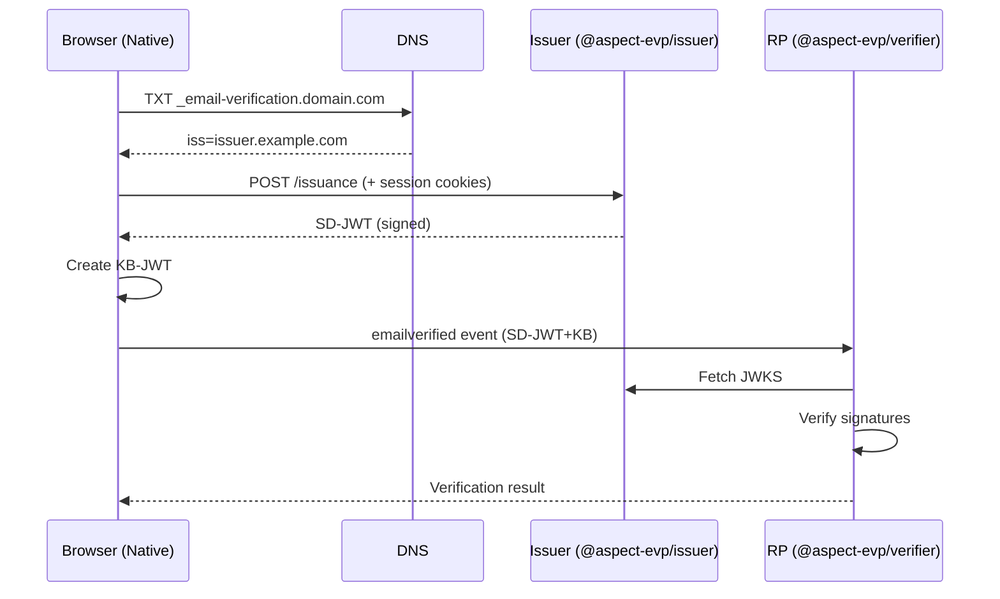

# EVP - Email Verification Protocol Libraries

[](https://www.npmjs.com/package/@aspect-evp/core)
[](https://github.com/aspect-evp/evp-js/actions/workflows/ci.yml)
[](https://opensource.org/licenses/MIT)

> ⚠️ **Early Stage Project**: This is an implementation of the [WICG Email Verification Protocol](https://github.com/WICG/email-verification-protocol), which is currently in incubation. The protocol specification may change, and browser support is not yet available.

## What is EVP?

The Email Verification Protocol enables web applications to obtain cryptographically verified email addresses without sending verification emails. Instead of the traditional "click the link in your email" flow, EVP allows instant verification when the user is already logged into their email provider.

```
Traditional Flow:
User → Enter email → Wait for email → Click link → Verified ❌ (slow, prone to drop-off)

EVP Flow:
User → Select email → Instant verification ✅ (seamless, no context switch)
```

## Packages

| Package | Description | npm |
|---------|-------------|-----|
| [`@aspect-evp/core`](./packages/core) | Shared types, constants, and utilities | [](https://www.npmjs.com/package/@aspect-evp/core) |
| [`@aspect-evp/issuer`](./packages/issuer) | EVP issuer for email providers | [](https://www.npmjs.com/package/@aspect-evp/issuer) |
| [`@aspect-evp/verifier`](./packages/verifier) | EVP verifier for web apps (RPs) | [](https://www.npmjs.com/package/@aspect-evp/verifier) |
| [`@aspect-evp/cli`](./packages/cli) | CLI for testing and debugging | [](https://www.npmjs.com/package/@aspect-evp/cli) |

## Installation

```bash
# Core libraries
npm install @aspect-evp/core @aspect-evp/issuer @aspect-evp/verifier

# CLI (optional, for testing)
npm install -g @aspect-evp/cli
```

## Quick Start

### For Email Providers (Issuer)

```typescript
import { EmailVerificationIssuer } from '@aspect-evp/issuer';

const issuer = new EmailVerificationIssuer({
  issuer: 'mail.example.com',
  privateKey: yourPrivateKeyJWK,
  kid: '2024-01-key',
  algorithm: 'EdDSA'
});

// Serve /.well-known/email-verification
app.get('/.well-known/email-verification', (req, res) => {
  res.json(issuer.getMetadata('https://mail.example.com'));
});

// Serve JWKS
app.get('/email-verification/jwks', (req, res) => {
  res.json(issuer.getJWKS());
});
```

### For Web Applications (Verifier/RP)

```typescript
import { EmailVerificationVerifier } from '@aspect-evp/verifier';

const verifier = new EmailVerificationVerifier({
  rpOrigin: 'https://myapp.example.com'
});

async function handleEmailVerification(sdJwtKb: string, sessionNonce: string) {
  const result = await verifier.verify(sdJwtKb, sessionNonce);
  console.log('Verified email:', result.email);
  console.log('Issuer:', result.issuer);
}
```

### CLI Usage

```bash
# Generate a keypair
evp keygen -o keys.json

# Run a complete test flow
evp test -e user@example.com -i issuer.example.com

# Inspect a token
evp inspect <token>

# Check DNS records for a domain
evp dns gmail.com
```

## Testing Without Browser Support

Since browsers don't yet support EVP, use the test utilities:

```typescript
import { createTestFlow } from '@aspect-evp/core/testing';
import { EmailVerificationVerifier } from '@aspect-evp/verifier';

const testFlow = await createTestFlow({
  issuer: 'issuer.example.com',
  rpOrigin: 'https://myapp.example.com',
});

const verifier = new EmailVerificationVerifier({
  rpOrigin: 'https://myapp.example.com',
  dnsResolver: testFlow.dnsResolver,
  fetch: testFlow.fetch,
});

const token = await testFlow.createToken('user@example.com', 'session-nonce');
const result = await verifier.verify(token, 'session-nonce');
```

## Architecture



## Development

```bash
git clone https://github.com/aspect-evp/evp-js.git
cd evp-js

pnpm install
pnpm build
pnpm test
pnpm test:coverage
```

### Scripts

| Command | Description |
|---------|-------------|
| `pnpm build` | Build all packages |
| `pnpm test` | Run tests |
| `pnpm test:coverage` | Run tests with coverage |
| `pnpm lint` | Lint code |
| `pnpm typecheck` | Type check |
| `pnpm changeset` | Create a changeset for release |

## Current Status

| Component | Status |
|-----------|--------|
| WICG Specification | 📝 Draft |
| Chrome Implementation | 🧪 Intent to Prototype |
| `@aspect-evp/*` | ✅ Published |

## Requirements

- Node.js >= 20.0.0

## Related Resources

- [WICG Email Verification Protocol Spec](https://github.com/WICG/email-verification-protocol)
- [Chrome Intent to Prototype](https://groups.google.com/a/chromium.org/g/blink-dev/c/pWfWupaOtJw)
- [SD-JWT Specification (IETF RFC 9901)](https://www.rfc-editor.org/rfc/rfc9901.html)

## License

MIT
