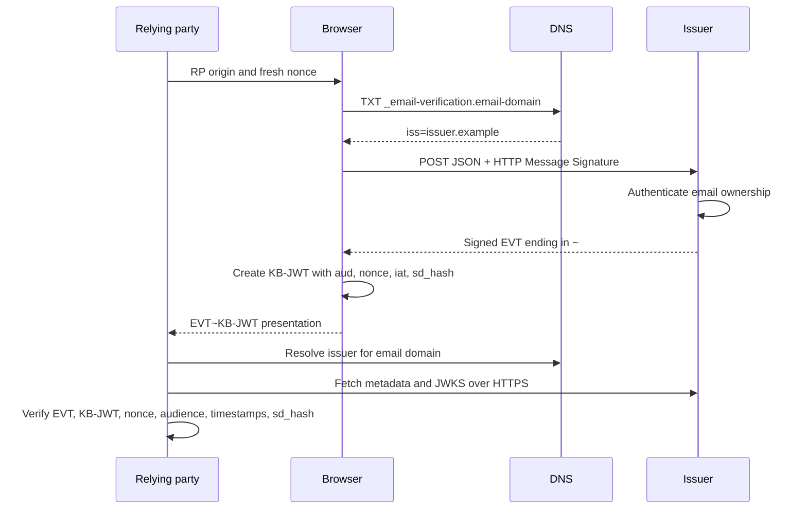

<!-- generated-by: gsd-doc-writer -->
# Protocol flow

EVP lets a relying party accept an email assertion issued by the email provider while binding that assertion to a browser-held key and an RP-provided nonce.

## Participants

- **Relying party (RP):** requests a verified address and verifies the final presentation.
- **Browser:** mediates issuance and proves possession of its ephemeral private key.
- **Issuer:** authenticates control of the email address and signs the EVT.
- **DNS:** delegates an email domain to exactly one issuer hostname using `_email-verification.<domain>`.

## End-to-end sequence

## 1. Issuer discovery

The resolver queries `TXT _email-verification.<email-domain>` and accepts exactly one valid `iss=<hostname>` value. Issuer identifiers must be hostnames without paths, credentials, or ports.

The verifier then retrieves `https://<issuer>/.well-known/email-verification`. The metadata must contain HTTPS `issuance_endpoint` and `jwks_uri` values. If `signing_alg_values_supported` is present, it must contain at least one supported algorithm.

## 2. Signed issuance request

The browser sends a JSON `POST` with `Sec-Fetch-Dest: email-verification`. The HTTP Message Signature profile covers:

- `@method`
- `@authority`
- `@path`
- `signature-key`
- `cookie` when a Cookie header is present

`Signature-Key` carries the browser's ephemeral public JWK. The issuer rejects missing components, cookie coverage mismatches, stale timestamps, unsupported keys, and invalid signatures before parsing the request body.

## 3. Issuer authentication and response

The application callback decides whether the request cookie controls the requested email. If cookie authentication fails, the optional WebAuthn callbacks may issue and verify a challenge.

On success, the issuer returns an `issuance_token`. Its signed JWT header contains `typ: "evt+jwt"`, `alg`, and `kid`; its payload contains `iss`, `iat`, `email`, `email_verified: true`, and `cnf.jwk`. The serialized EVT ends with `~`.

Private and directed addresses are optional application-owned extensions. A private result is marked with `is_private_email: true`.

## 4. Key binding

The browser creates a `typ: "kb+jwt"` JWT signed by the private key corresponding to `cnf.jwk`. Its payload binds the presentation to:

- `aud`: the exact RP origin;
- `nonce`: the RP's session-bound challenge;
- `iat`: a fresh integer timestamp;
- `sd_hash`: SHA-256 of the complete EVT, including the trailing `~`.

## 5. RP verification

`EmailVerificationVerifier.verify()` fails closed. It validates structure and types, DNS delegation, issuer metadata, the EVT signature and claims, the KB-JWT signature, exact audience and nonce equality, timestamps, and `sd_hash`. Only a successful result is an authenticated email assertion.

## Failure handling

Protocol failures use `EVPError`. Issuers should serialize errors with `toJSON()` or `toResponse()`. RPs should catch verification errors and fall back to their normal email-verification flow; they must never use claims decoded from a rejected token.
